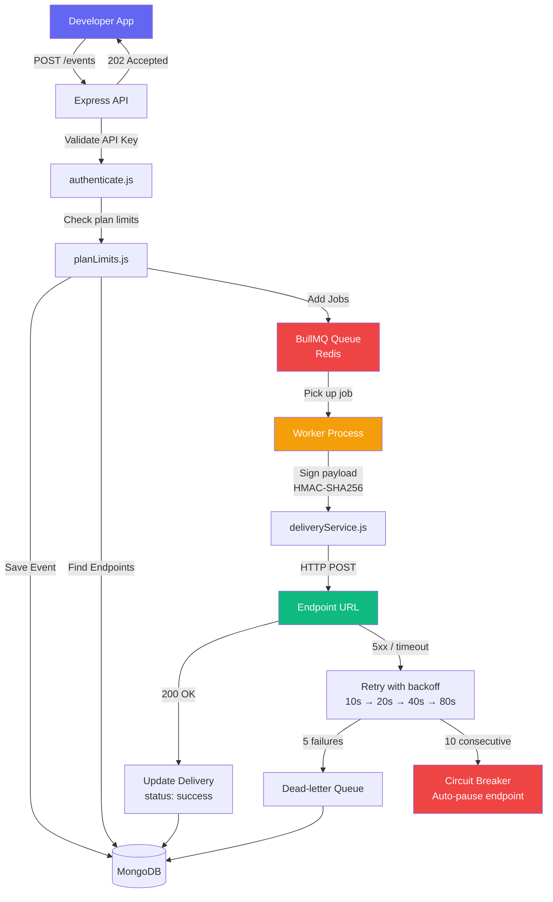
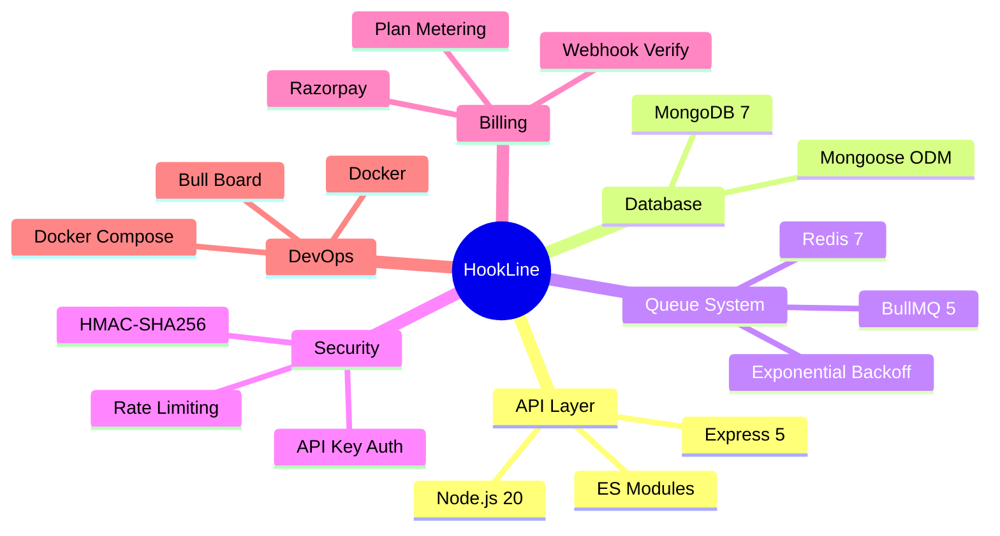
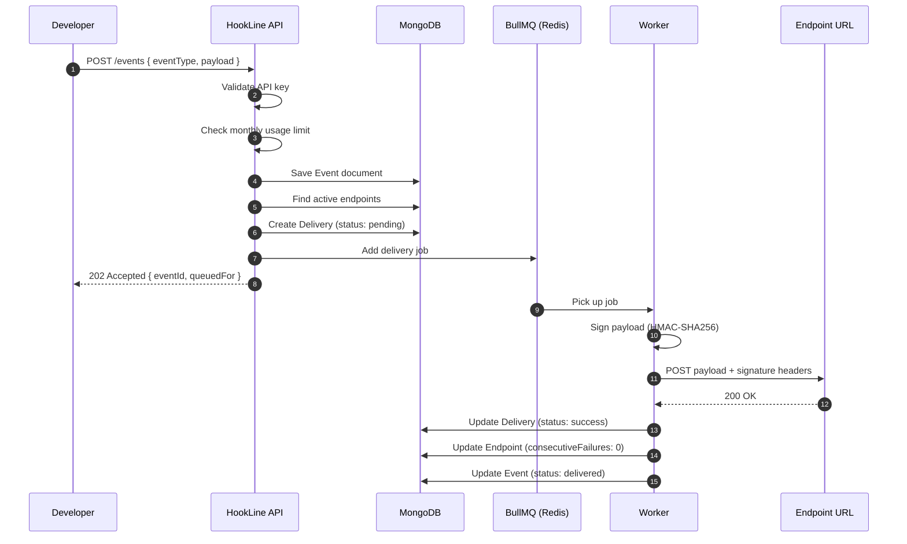

<div align="center">

# ⚡ HookLine

### Production-grade Webhook Delivery Engine SaaS

[](https://nodejs.org)
[](https://expressjs.com)
[](https://mongodb.com)
[](https://redis.io)
[](https://docs.bullmq.io)
[](https://docker.com)

<br/>

> **Register endpoints. Fire events. We handle delivery — reliably, at scale.**
>
> HookLine is the indie alternative to [Svix](https://svix.com) and [Hookdeck](https://hookdeck.com).
> Every SaaS product needs webhooks. HookLine is the infrastructure they plug into.

<br/>

</div>

---
## 🏗️ System Architecture


---
## 🛠️ Tech Stack


---

## ✨ Features

| Feature | Description |
|---|---|
| 🔑 **Multi-tenant** | Every project gets its own API key and signing secret |
| 📬 **Reliable delivery** | BullMQ queue with exponential backoff — up to 5 retry attempts |
| 🔐 **HMAC-SHA256 signing** | Every payload is signed — receivers can verify authenticity |
| 📋 **Delivery logs** | Full history of every attempt — status, latency, response body |
| ♻️ **Manual replay** | Resend any failed webhook with a single API call |
| ⚡ **Circuit breaker** | Endpoints that fail 10 times in a row are auto-paused |
| 📊 **Bull Board** | Real-time queue monitoring dashboard at `/admin/queues` |
| 💳 **Razorpay billing** | Upgrade plans via payment orders and webhook verification |
| 🛡️ **Rate limiting** | Per-route rate limits to prevent abuse |
| 🐳 **Docker ready** | Runs with a single command locally and on any VPS |

---
## 🔄 Request Lifecycle



---

## 💰 Pricing Plans


---


## 🚀 Getting Started

### Prerequisites
- Node.js 20+
- Docker + Docker Compose
- pnpm

### Local Development

```bash
# 1. Clone the repo
git clone https://github.com/rahul-singh011/hookline
cd hookline

# 2. Install dependencies
pnpm install

# 3. Set up environment
cp .env.example .env
# Fill in your values in .env

# 4. Start MongoDB and Redis
docker compose up -d

# 5. Terminal 1 — API server
pnpm dev

# 6. Terminal 2 — Worker process
pnpm worker
```

Open Bull Board: `http://localhost:3000/admin/queues`

---

## 📡 API Reference

### Create a Project (Sign up)
```bash
POST /auth/projects
Content-Type: application/json

{ "name": "My App" }
```

### Register a Webhook Endpoint
```bash
POST /endpoints
Authorization: Bearer <api_key>

{ "url": "https://yourserver.com/webhooks", "description": "Production" }
```

### Fire an Event
```bash
POST /events
Authorization: Bearer <api_key>

{ "eventType": "order.created", "payload": { "orderId": "123", "amount": 999 } }
```

### View Delivery Logs
```bash
GET /deliveries
GET /deliveries?eventId=xxx
GET /deliveries?status=failed
GET /deliveries?endpointId=xxx
```

### Replay a Failed Delivery
```bash
POST /deliveries/:id/replay
Authorization: Bearer <api_key>
```

### Billing
```bash
GET  /billing/plans          # view all plans
GET  /billing/usage          # current usage stats
POST /billing/order          # { "plan": "pro" } → create Razorpay order
POST /billing/verify         # verify payment + upgrade plan
```

---

## 🔐 Signature Verification

Every delivery includes an `X-HookLine-Signature` header. Verify it on your server:

```js
import crypto from 'crypto'

const verifySignature = (payload, signature, secret) => {
  const expected = crypto
    .createHmac('sha256', secret)
    .update(JSON.stringify(payload))
    .digest('hex')

  return `sha256=${expected}` === signature
}

// In your webhook handler
app.post('/webhooks', (req, res) => {
  const isValid = verifySignature(
    req.body,
    req.headers['x-hookline-signature'],
    process.env.HOOKLINE_SIGNING_SECRET
  )

  if (!isValid) return res.status(401).json({ error: 'Invalid signature' })

  // Process the webhook
  console.log('Event type:', req.headers['x-hookline-event'])
  console.log('Payload:', req.body)

  res.json({ received: true })
})
```

---

## 🌍 Deployment

```bash
# Deploy everything on a VPS with one command
docker compose -f docker-compose.prod.yml up -d
```

Spins up four containers: MongoDB, Redis, API server, Worker — all connected on an internal Docker network.

---

## ⚙️ Environment Variables

```bash
PORT=3000
MONGO_URI=mongodb://localhost:27017/hookline
REDIS_HOST=localhost
REDIS_PORT=6379
API_KEY_SECRET=your_secret_here
HMAC_SECRET=your_hmac_secret_here
RAZORPAY_KEY_ID=rzp_test_your_key_here
RAZORPAY_KEY_SECRET=your_key_secret_here
RAZORPAY_WEBHOOK_SECRET=your_webhook_secret_here
CLIENT_URL=http://localhost:3000
```

---

## 🧠 What I Learned Building This

- **Async queue architecture** — decoupling API responses from background processing
- **BullMQ internals** — retries, backoff, concurrency, dead-letter queues
- **HMAC-SHA256 signing** — payload authentication between distributed services
- **Circuit breaker pattern** — automatically pausing failing endpoints
- **Multi-tenancy** — tenant isolation via projectId scoping on every query
- **Atomic MongoDB operations** — `$inc` for race-condition-safe counters
- **Redis as infrastructure** — not just cache, but the backbone of a job queue
- **Razorpay billing** — order creation, signature verification, webhook handling

---

<div align="center">

Built by **Rahul Singh**


</div>
